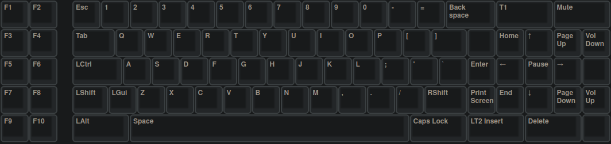
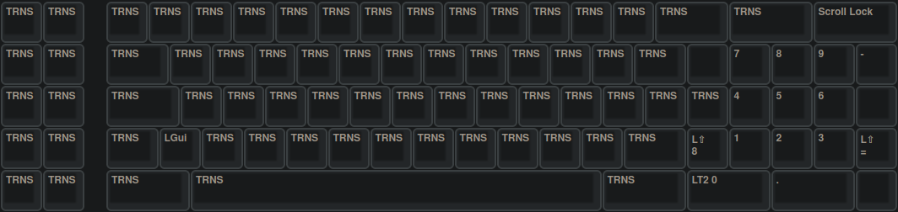
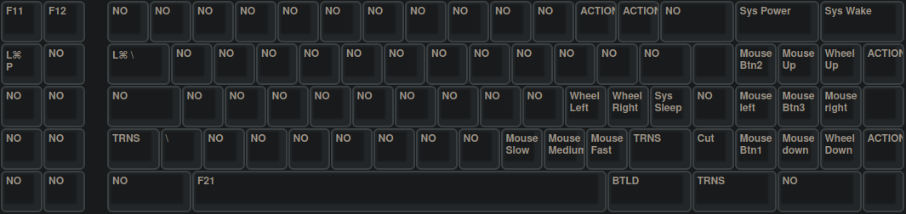

# Zenith Keyboard Converter

The converter translates IBM PC keyboard protocols to use classic keyboards with USB ports. It supports both IBM XT and AT protocols, and all of scan code set 1, 2 and 3 with one firmware.

This project is intended to integrated existent TMK XT, PS/2 and Terminal converters.

## Hardware

Firmware supports ATMega32u4 and ATMega32u2 by default, Teensy2 or ProMicro can be used.
Wire controller pins below to keyboard signals, besides VCC and GND. This is compatible for Soarer's converter.

- Data    PD0
- Clock   PD1
- Reset   PB6 or PB7 (For some of XT keyboards. Not needed for AT, PS/2 and Terminal)

### 5-Pin DIN 180° (DIN41524) female assignment


| 5-Pin DIN | Description | Cable color | Board Pin |
| :-------: | :---------- | :---------- | :-------: |
| 1         | Clock       | black       | 2         |
| 2         | Data        | red         | 3         |
| 3         | Reset       | white       | 10        |
| 4         | GND         | green       | GND       |
| 5         | +5V         | yellow      | VCC       |

## Keyboard discrimination

This section explains how the converter determines proper protocol and scan code set for keyboard. The converter need to do that before starting to receive and translate scan codes from keyboard.

### Keyboard ID

After startup the converter sends 0xF2 command to get keyboard ID and sees how the keyboard responds to the command.

Response from keyboard:

- XT keyboard doesn't support any command and returns no response.
- AT keyboard should respond with 0xFA to the command but returns no keyboard ID.
- PS/2 keyboard should respond with 0xFA to the command, followed by keyboard ID, such as 0xAB86.
- Terminal keyboard should respond with 0xFA to the command, followed by keyboard ID, such as 0xBFBF.

Now we can discriminate the keyboard and determine suitable protocol and scan code set as described below.

### Protocol

- Signals from XT keyboard are recognized by XT protocol.
- Signals from AT, PS/2 and Terminal keyboard are recognized by AT protocol.

### Scan code Set

- Scan codes from XT keyboard are handled as CodeSet1.
- Scan codes from AT and PS/2 keyboard are handled as CodeSet2.
- Scan codes from Terminal keyboard are handled as CodeSet3.

## Firmware

The next descriptions refer to Linux, but can certainly also be applied to windows systems, in a slightly modified form. The unimap layers are configured as shown in the following pictures:





### Flash firmware

First (if not already done) install the Arduino environment to compile and flash the firmware:

```bash
sudo pacman -S arduino-avr-core
```

Download the precompiled firmware from [zenith-xt-usb/firmware](https://github.com/mrdotx/zenith-xt-usb/tree/master/firmware) or build it by yourself:

```bash
make clean
make
```

First of all, we should identify to which serial device the Pro Micro is connected to (normally it is /dev/ttyACM0). Connect the Pro Micro to the USB port of your computer and verify it with the list of serial devices:

```bash
ls /dev/tty*
```

Navigate to the directory where the firmware is downloaded or compiled. Quickly connect GND + RST pins on the Pro Micro to enter the Bootloader mode and execute the following command to flash the firmware:

```bash
sudo avrdude -p atmega32u4 -P /dev/ttyACM0 -c avr109 -U flash:w:zenith_usb.hex
```

## Links

- [hasu - IBM PC Keyboard Converter](https://geekhack.org/index.php?topic=103648.0)
- [TMK Keymap Editor](https://www.tmk-kbd.com/tmk_keyboard/editor/unimap/?ibmpc_usb_1286_xt)
